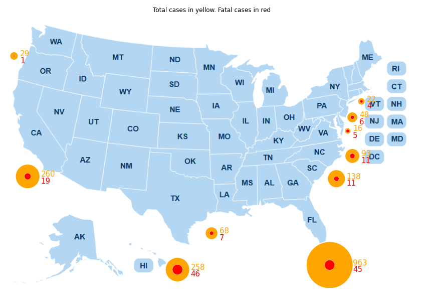

 <div style=></div>

# Shark Attack Kaggle Dataset. Cleaning, Visualization and Storytelling

 <div style="text-align:center"></div>

The scope of [this Ironhack project](https://github.com/sgonzalainen/datamad1020-rev/tree/master/projects/W2-Pandas-project) is to clean a messy dataset, try to get some graphic insights with a storytelling behind.

## Description
According to information from different references __[1](https://www.newsweek.com/shark-attack-which-country-most-deadly-699748)__ __[2](https://en.wikipedia.org/wiki/Shark_attack)__, *USA* shows the largest number of shark attacks. However. it is *Australia* the country with the deadliest shark attact rate.

Therefore, my motive for this study is to verify whether this assumption is true or not based on the dataset *Global Shark Attacks* from __[Kaggle](https://www.kaggle.com/teajay/global-shark-attacks)__ and also find additional differences between those two countries.

The following questions will be answered by visualization:
* Which country has the largest number of cases? and which one with highest rates of fatality?
* Which areas are more affected by shark attacks? 
* Is there any seasonality during the year on those numbers?
* What's the trend in the number of attacks during the last decades?
* What are the top5 most dangerous species per country?

Below an example of a plot created for the study:

<div style="text-align:center"></div>


## Environment
 Python3 on Ubuntu 20.04

 ```python
import re
import numpy as np
import matplotlib.pyplot as plt
import seaborn as sns
import pandas as pd
```


